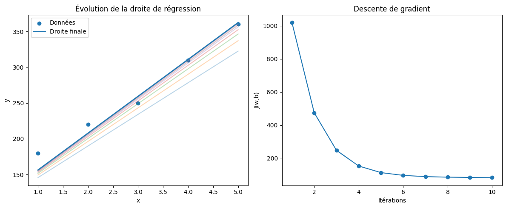

**ML From Scratch**

Apprentissage du Machine Learning en partant de zéro sans librairies, juste les maths et Python.

**Objectif**

Ce repository documente mon apprentissage du Machine Learning en implémentant les algorithmes à la main, afin de comprendre en profondeur leur fonctionnement.

L’idée est simple :

**comprendre avant d’utiliser des librairies comme scikit-learn**

**Projet actuel : Régression linéaire**

Dans ce projet, j’ai implémenté :

La régression linéaire

La fonction de coût (Mean Squared Error)

La descente de gradient

La mise à jour des paramètres w et b

La visualisation :

    -de la droite de régression

    -de la convergence du coût

**Concepts appris**

Apprentissage supervisé

Fonction de coût

Descente de gradient

Optimisation

Convergence et oscillations

Impact des variables (features)

**Technologies utilisées**

Python

Matplotlib

**Résultats**

Visualisation de l’évolution de la droite de régression

Courbe de la descente de gradient

Compréhension concrète du comportement du modèle

**Ce que j’ai retenu**

Un modèle n’est jamais parfait

Il cherche à minimiser l’erreur globale

Les données influencent fortement l’apprentissage

Comprendre les maths change totalement la manière d’apprendre le ML

**Contribution**

Ce projet est avant tout un journal d’apprentissage, mais toute suggestion ou amélioration est la bienvenue !

**Contact**

N’hésite pas à me contacter ou à échanger sur le Machine Learning 🚀

